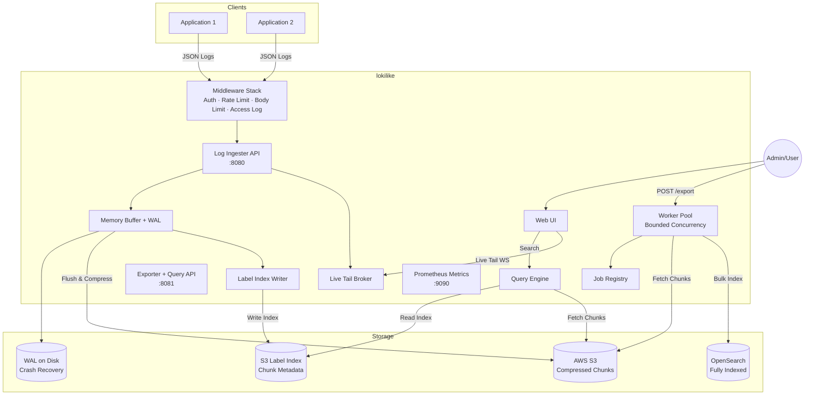
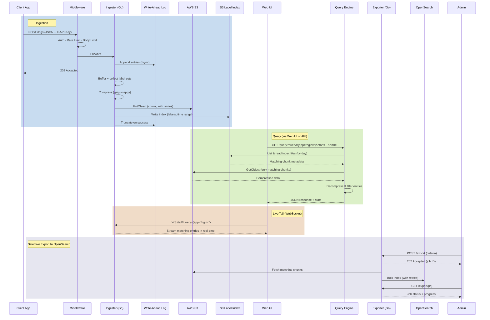

# lokilike

A lightweight, horizontally scalable log aggregation system that uses S3 as its primary backing store. Designed from first principles around the idea that most logs should live in cheap object storage, and only a targeted subset should be fully indexed for deep analysis.

## Architecture



### Data Flow



## Design Philosophy

**Store everything, index selectively.** Traditional log systems index every line on ingest, which gets expensive fast. lokilike takes a different approach:

1. **Ingest cheaply** — logs are buffered in memory (with a WAL for crash safety), compressed, and flushed to S3. A minimal label index is written alongside each chunk. S3 is the source of truth.
2. **Query directly** — the query engine reads the label index to identify relevant chunks, fetches only those, decompresses, and filters. No external database needed for ad-hoc searches.
3. **Export on demand** — for deep analysis, an export job pushes matching logs to OpenSearch. You pay OpenSearch prices only for what you're investigating.
4. **Tail live** — a WebSocket endpoint streams entries in real-time as they're ingested, filtered by labels and level.

## Project Structure

```
lokilike/
├── cmd/
│   ├── ingester/main.go            # Ingestion server + /tail WebSocket
│   └── exporter/
│       ├── main.go                  # Export worker + query API + web UI
│       └── web/index.html           # Embedded web UI (SPA)
├── internal/
│   ├── config/config.go             # Config with validation + defaults
│   ├── domain/
│   │   ├── log_entry.go             # LogEntry struct
│   │   ├── chunk.go                 # Chunk + compression types + label sets
│   │   └── export_job.go            # ExportJob lifecycle
│   ├── ingester/
│   │   ├── buffer.go                # Buffer with WAL, label collection, level sampling
│   │   ├── handler.go               # POST /logs with entry limits
│   │   ├── s3_flusher.go            # S3 writer with retries + index writing
│   │   ├── wal.go                   # Write-ahead log for crash recovery
│   │   └── broker.go                # Pub/sub fan-out for live tail
│   ├── exporter/
│   │   ├── exporter.go              # S3 scan, decompress, filter, export with retries
│   │   ├── opensearch.go            # OpenSearch bulk index client
│   │   ├── registry.go              # In-memory job registry with cancellation
│   │   └── pool.go                  # Bounded worker pool
│   ├── index/index.go               # Label index: ChunkIndex model + S3 store
│   ├── query/
│   │   ├── parser.go                # Loki-style label selector parser
│   │   └── query.go                 # Query engine: index lookup + chunk fetch + filter
│   ├── logger/logger.go             # Structured JSON logging via slog
│   ├── metrics/metrics.go           # Prometheus metrics definitions
│   ├── middleware/middleware.go      # Auth, rate limit, body limit, access log
│   ├── retry/retry.go               # Exponential backoff with jitter
│   ├── storage/s3.go                # S3 client with metrics + raw key support
│   └── integration/
│       └── integration_test.go      # Integration tests (MinIO)
├── config.json                      # Production config template
├── config.local.json                # Local dev config (MinIO + OpenSearch)
├── docker-compose.yml               # MinIO + OpenSearch for local dev
└── Makefile
```

## Quick Start

### Prerequisites

- Go 1.21+
- Docker & Docker Compose

### One-Command Quickstart

```bash
./quickstart.sh
```

This builds the project, starts MinIO + OpenSearch via Docker, launches both services, sends sample log data, and prints the URLs. Press Ctrl+C to stop everything.

### Manual Local Development

```bash
make dev-up          # Start MinIO + OpenSearch
make run-ingester    # Start ingester on :8080 (terminal 1)
make run-exporter    # Start exporter on :8081 (terminal 2)
```

Open the web UI: **http://localhost:8081/ui**

MinIO console: `http://localhost:9001` (minioadmin/minioadmin)

### Send Logs

```bash
curl -X POST http://localhost:8080/logs \
  -H "Content-Type: application/json" \
  -d '{
    "entries": [
      {
        "timestamp": "2026-03-23T10:00:00Z",
        "service": "myapp",
        "level": "info",
        "message": "user logged in",
        "labels": {"app": "nginx", "env": "prod", "cluster": "us-west-2"}
      },
      {
        "timestamp": "2026-03-23T10:01:00Z",
        "service": "myapp",
        "level": "error",
        "message": "database connection timeout",
        "labels": {"app": "nginx", "env": "prod"}
      }
    ]
  }'
```

### Query Logs (API)

```bash
# Search by labels and time range
curl 'http://localhost:8081/query?start=2026-03-23T00:00:00Z&end=2026-03-24T00:00:00Z&query={app="nginx",env="prod"}&level=error&limit=100'
```

Response:
```json
{
  "entries": [{"timestamp": "...", "service": "myapp", "level": "error", "message": "...", "labels": {...}}],
  "stats": {
    "index_files_scanned": 5,
    "chunks_matched": 2,
    "chunks_fetched": 2,
    "entries_scanned": 500,
    "entries_matched": 3,
    "duration_ms": 142
  }
}
```

### Query Logs (Web UI)

Open **http://localhost:8081/ui** and use:
- Time range pickers for start/end
- Label query field: `{app="nginx", env="prod"}`
- Level filter dropdown
- Click **Search** to query, or **Tail** for live streaming

### Live Tail (WebSocket)

Connect directly via WebSocket for programmatic tailing:
```bash
wscat -c 'ws://localhost:8080/tail?query={app="nginx"}&level=error'
```
Entries stream as JSON, one per message.

### Export to OpenSearch

```bash
# Start an export job
curl -X POST http://localhost:8081/export \
  -H "Content-Type: application/json" \
  -d '{
    "start_time": "2026-03-23T00:00:00Z",
    "end_time": "2026-03-24T00:00:00Z",
    "service": "myapp",
    "label_filters": {"env": "prod"}
  }'

# Poll job status
curl http://localhost:8081/export/<job-id>

# List all jobs
curl http://localhost:8081/export

# Cancel a running job
curl -X DELETE http://localhost:8081/export/<job-id>
```

## Label Index

The label index is the key to efficient queries. Instead of scanning every chunk in a time range, the query engine reads lightweight index files first and only fetches chunks that could contain matching entries.

### How It Works

When the ingester flushes a chunk to S3, it also writes a small JSON index file:

```
S3 bucket:
  raw_logs/myapp/2026/03/23/1679558400-abc.gz     ← chunk (compressed logs)
  index/2026/03/23/myapp-1679558400-abc.json       ← index (metadata)
```

Index file contents:
```json
{
  "chunk_key": "myapp/2026/03/23/1679558400-abc.gz",
  "service": "myapp",
  "min_time": "2026-03-23T10:00:00Z",
  "max_time": "2026-03-23T10:00:30Z",
  "label_sets": [
    {"app": "nginx", "env": "prod", "cluster": "us-west-2"},
    {"app": "nginx", "env": "staging"}
  ],
  "entry_count": 847,
  "size_bytes": 24391,
  "compression": "gzip"
}
```

### Query Path

```
Without index:  ListObjects(day prefix) → GetObject(ALL chunks) → decompress → filter
With index:     ListObjects(index prefix) → read small JSONs → filter → GetObject(MATCHING chunks only)
```

For a query like `{app="nginx", env="prod"}` over 24 hours with 10,000 chunks, the index might narrow it to 50 chunks — a 200x reduction in S3 reads.

### Label Selector Syntax

Loki/Prometheus-style equality matchers:

```
{app="nginx"}                          # single label
{app="nginx", env="prod"}             # multiple labels (AND)
{app="nginx", cluster="us-west-2"}    # any label key/value
```

The `service` key is treated specially in the query API — it filters by the `service` field on `LogEntry`, not the labels map.

## Web UI

The web UI is an embedded single-page application served at `/ui` on the exporter. No separate build step or deployment required — it's compiled into the Go binary via `embed.FS`.

Features:
- Dark theme with monospace font
- Time range pickers (defaults to last hour)
- Loki-style label query input: `{app="nginx", env="prod"}`
- Level filter dropdown (debug/info/warn/error/fatal)
- Result limit control
- Color-coded log levels (green=info, yellow=warn, red=error)
- Inline label tags
- Query performance stats bar
- **Live tail** toggle — streams entries via WebSocket with auto-scroll

The UI fetches its configuration (ingester WebSocket URL) from `/ui/config` on the exporter.

## Live Tail

The ingester includes a pub/sub broker that fans out ingested entries to WebSocket subscribers in real-time.

### WebSocket Endpoint

```
WS /tail?query={app="nginx"}&level=error
```

- Served by the ingester on its listen address (default `:8080`)
- Supports label filtering and level filtering
- Each subscriber gets a 256-entry buffered channel
- Slow consumers drop entries (non-blocking)
- Automatic cleanup on disconnect

### How It Works

1. Client connects via WebSocket to the ingester's `/tail` endpoint
2. The query string is parsed into a label filter + level filter
3. A subscriber is registered with the broker
4. Every entry accepted by the buffer is published to all matching subscribers
5. Entries are sent as JSON text messages over the WebSocket
6. On disconnect, the subscriber is unregistered

## Configuration

Configuration is JSON with `${ENV_VAR}` expansion.

```json
{
  "debug": false,
  "tenant_id": "",
  "ingester": {
    "listen_address": ":8080",
    "batch_size_bytes": 5242880,
    "batch_time_window_sec": 30,
    "compression_algo": "gzip",
    "max_body_bytes": 10485760,
    "max_entries_per_request": 10000,
    "rate_limit_rps": 0,
    "wal_dir": "/var/lib/lokilike/wal",
    "tls": { "enabled": false, "cert_file": "", "key_file": "" },
    "min_level": ""
  },
  "storage": {
    "s3": {
      "bucket": "my-log-bucket",
      "region": "us-west-2",
      "prefix": "raw_logs/",
      "endpoint": "",
      "use_path_style": false,
      "retention_days": 90
    },
    "index": {
      "prefix": "index/"
    }
  },
  "exporter": {
    "listen_address": ":8081",
    "opensearch": {
      "endpoint": "https://my-cluster.example.com",
      "index_prefix": "exported-logs-",
      "username": "${OS_USERNAME}",
      "password": "${OS_PASSWORD}"
    },
    "default_batch_size": 1000,
    "max_concurrent_jobs": 4,
    "ingester_url": "ws://localhost:8080"
  },
  "auth": { "enabled": true, "api_keys": ["${API_KEY}"] },
  "metrics": { "enabled": true, "address": ":9090" }
}
```

### Settings Reference

| Setting | Description | Default |
|---------|-------------|---------|
| `debug` | Enable DEBUG-level structured logging | `false` |
| `tenant_id` | Tenant prefix for S3 paths and OpenSearch indices | `""` |
| `ingester.batch_size_bytes` | Flush when buffer exceeds this size | 5 MB |
| `ingester.batch_time_window_sec` | Flush after this many seconds | 30 |
| `ingester.compression_algo` | `gzip` or `snappy` | `gzip` |
| `ingester.max_body_bytes` | Max HTTP request body size | 10 MB |
| `ingester.max_entries_per_request` | Max entries per POST /logs | 10000 |
| `ingester.rate_limit_rps` | Requests per second (0 = unlimited) | 0 |
| `ingester.wal_dir` | WAL directory for crash recovery (empty = disabled) | `""` |
| `ingester.tls.enabled` | Enable TLS on the ingester | `false` |
| `ingester.min_level` | Drop log entries below this level (e.g., `warn`) | `""` |
| `storage.s3.endpoint` | Custom S3 endpoint (MinIO/LocalStack) | `""` |
| `storage.s3.retention_days` | Document S3 lifecycle policy TTL | 90 |
| `storage.index.prefix` | S3 prefix for label index files | `index/` |
| `exporter.max_concurrent_jobs` | Max parallel export jobs | 4 |
| `exporter.ingester_url` | Ingester WebSocket URL for live tail in UI | `ws://localhost:8080` |
| `auth.enabled` | Require X-API-Key header | `false` |
| `auth.api_keys` | Valid API keys | `[]` |
| `metrics.enabled` | Expose Prometheus /metrics | `false` |
| `metrics.address` | Metrics server listen address | `:9090` |

Config is validated on startup — missing required fields or invalid values will prevent the service from starting.

## API Reference

### Ingester (default `:8080`)

| Method | Path | Description |
|--------|------|-------------|
| `POST` | `/logs` | Ingest log entries |
| `GET` | `/health` | Health check |
| `WS` | `/tail?query={...}&level=...` | Live tail via WebSocket |

### Exporter (default `:8081`)

| Method | Path | Description |
|--------|------|-------------|
| `GET` | `/query?start=...&end=...&query={...}&level=...&limit=N` | Query logs from S3 via label index |
| `POST` | `/export` | Create an export job to OpenSearch |
| `GET` | `/export` | List all export jobs |
| `GET` | `/export/{id}` | Get export job status |
| `DELETE` | `/export/{id}` | Cancel a running export job |
| `GET` | `/ui` | Web UI |
| `GET` | `/ui/config` | UI config (ingester WebSocket URL) |
| `GET` | `/health` | Health check |

## Production Features

### Write-Ahead Log (WAL)

Set `ingester.wal_dir` to enable crash recovery. Entries are appended to an NDJSON WAL file (with fsync) before being buffered in memory. After a successful S3 flush, the WAL is truncated. On startup, uncommitted entries are replayed into the buffer.

### Retry with Exponential Backoff

All S3 writes and OpenSearch bulk-index operations retry up to 3 times with exponential backoff and jitter (200ms base, 10s max). Transient failures don't cause data loss.

### Flush Failure Retention

If an S3 flush fails, the buffer is **not cleared**. Entries remain in memory (and WAL) for retry on the next flush cycle.

### Request Body & Entry Limits

- `max_body_bytes` (default 10MB): Limits HTTP request body via `MaxBytesReader` to prevent OOM.
- `max_entries_per_request` (default 10,000): Rejects oversized requests (413).

### API Key Authentication

Set `auth.enabled: true` and provide API keys. All requests (except `/health` and `/metrics`) require a valid `X-API-Key` header.

### Rate Limiting

Set `ingester.rate_limit_rps` to enable a token-bucket rate limiter. Returns `429 Too Many Requests`.

### TLS

Set `ingester.tls.enabled: true` with `cert_file` and `key_file` to serve HTTPS.

### Bounded Export Concurrency

Export jobs run in a worker pool with `max_concurrent_jobs` slots (default 4). Returns `503` when full.

### Compression Negotiation

`gzip` (default) or `snappy`. The query engine and exporter auto-detect from file extension (`.gz`/`.sz`).

### Log Level Sampling

Set `ingester.min_level` (e.g., `warn`) to drop entries below that level during ingestion.

### Multitenancy

Set `tenant_id` to scope all S3 paths (data + index) under `<prefix>/<tenant_id>/`.

### Structured Logging

All internal logging uses Go's `log/slog` with JSON output to stderr.

### Access Logging

Every HTTP request is logged with method, path, status code, duration, and bytes written.

## S3 Key Layout

```
<bucket>/
  raw_logs/                         ← data prefix
    [tenant_id/]
      myapp/
        2026/03/23/
          1679558400-a1b2c3d4.gz    (chunk, gzip)
          1679558430-e5f6a7b8.sz    (chunk, snappy)
  index/                            ← index prefix
    [tenant_id/]
      2026/03/23/
        myapp-1679558400-a1b2c3d4.json   (label index)
        myapp-1679558430-e5f6a7b8.json
```

### S3 Retention

Set `storage.s3.retention_days` to document your bucket lifecycle policy. **Configure the actual S3 lifecycle rule on the bucket itself** (via Terraform or AWS console).

## Prometheus Metrics

Enable with `metrics.enabled: true`. Served at `http://<metrics.address>/metrics`.

| Metric | Type | Description |
|--------|------|-------------|
| `lokilike_entries_received_total` | Counter | Log entries accepted |
| `lokilike_entries_dropped_total` | Counter | Entries dropped (by reason) |
| `lokilike_entries_buffered` | Gauge | Current buffer depth |
| `lokilike_chunks_flushed_total` | Counter | Chunks written to S3 |
| `lokilike_flush_errors_total` | Counter | Failed flush attempts |
| `lokilike_flush_duration_seconds` | Histogram | Compress + upload latency |
| `lokilike_bytes_flushed_total` | Counter | Compressed bytes to S3 |
| `lokilike_wal_entries` | Gauge | Current WAL depth |
| `lokilike_wal_recovered_total` | Counter | Entries recovered on startup |
| `lokilike_s3_operations_total` | Counter | S3 calls by operation/status |
| `lokilike_s3_duration_seconds` | Histogram | S3 operation latency |
| `lokilike_export_jobs_total` | Counter | Export jobs by final status |
| `lokilike_export_logs_indexed_total` | Counter | Logs sent to OpenSearch |
| `lokilike_bulk_index_duration_seconds` | Histogram | OpenSearch bulk latency |
| `lokilike_http_requests_total` | Counter | HTTP requests by method/path/status |
| `lokilike_http_duration_seconds` | Histogram | HTTP request latency |

## Testing

### Quick Start

```bash
./test.sh
```

Runs the full test suite in one command: build, vet, 78 unit tests, integration tests (if MinIO is running), and prints per-package coverage.

### Unit Tests

```bash
make test              # 78 tests, quiet output
make test-verbose      # with full test names
make test-coverage     # generate coverage report
```

**78 tests** across 7 packages:

| Package | Tests | Coverage | What's Tested |
|---------|-------|----------|---------------|
| `config` | 7 | 94% | Validation (missing fields, bad compression, TLS without certs, auth without keys), defaults, env var expansion |
| `ingester` | 29 | 73% | Buffer (size/time flush, flush-failure retention, min-level sampling, label collection, snappy), handler (HTTP codes, entry limits), WAL (append/recover/reset), broker (pub/sub, filtering, slow consumers) |
| `exporter` | 13 | 8% | Entry matching (time, service, labels), time prefix generation |
| `middleware` | 10 | 67% | API key auth (valid/invalid/missing/exempt paths), rate limiting (burst/reject), body limits (oversized/small), chain ordering |
| `index` | 12 | 46% | Label matching (exact, subset, mismatch, multi-set), time overlap (full/partial/none/edge), index key format, day prefixes |
| `query` | 3 | 23% | Label selector parsing (valid syntax, whitespace, invalid inputs) |
| `retry` | 4 | 86% | First-attempt success, retry-then-succeed, exhaust retries, context cancellation |

### Integration Tests

```bash
make dev-up            # start MinIO + OpenSearch
make test-integration  # run against real S3 (MinIO)
make test-all          # unit + integration
```

Tests S3 round-trip (put/get/list) and full ingest pipeline (buffer -> compress -> flush to MinIO -> read back -> decompress -> verify).

### Coverage Report

```bash
make test-coverage
# Generates coverage.out, prints per-function coverage
# For HTML: go tool cover -html=coverage.out
```

## Makefile

| Target | Description |
|--------|-------------|
| `make build` | Compile all packages |
| `make test` | Run 78 unit tests |
| `make test-verbose` | Unit tests with full output |
| `make test-coverage` | Generate coverage report |
| `make test-integration` | Start Docker, run integration tests |
| `make test-all` | Unit + integration tests |
| `make dev-up` / `make dev-down` | Manage local Docker services |
| `make run-ingester` | Run ingester with local config |
| `make run-exporter` | Run exporter with local config |

## Deployment Notes

- AWS SDK credential resolution: env vars, IAM roles, instance profiles
- Leave `storage.s3.endpoint` empty for real AWS S3
- Set `auth.enabled: true` and inject API keys via `${ENV_VARS}`
- Set `exporter.ingester_url` to the ingester's WebSocket address for the UI's live tail
- Both services expose `/health` for load balancer health checks
- WAL directory should be on fast local storage (not NFS)
- Graceful shutdown: SIGINT/SIGTERM flushes buffer, drains export jobs
- Set up an S3 lifecycle rule matching `retention_days` for automatic cleanup
